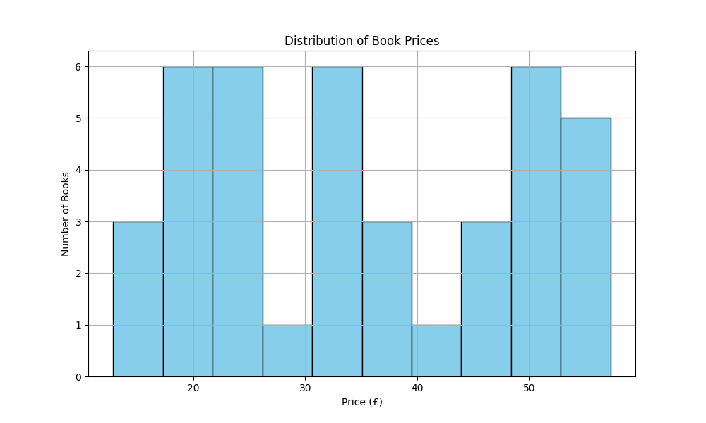
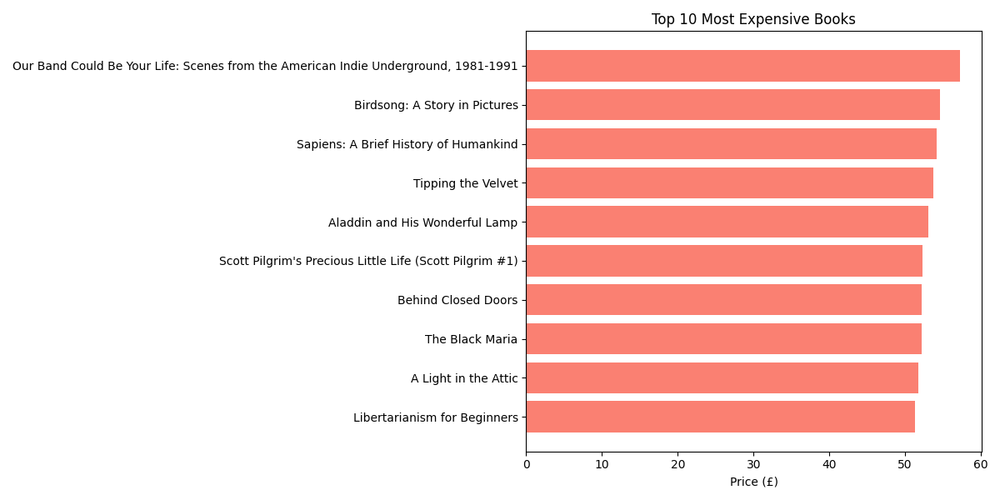

📚 Books Scraper Analysis

This project analyzes a dataset of book titles and prices scraped from a fictional bookstore website. It demonstrates how data can be cleaned, analyzed, and visualized using Python, making it useful for automating reports and generating insights.

---

📊 Key Insights
- **Average Book Price**: £34.96  
- **Most Expensive Book**: `Our Band Could Be Your Life: Scenes from the American Indie Underground, 1981-1991` - £57.25  
- **Cheapest Book**: `In Her Wake` - £12.84

---

📈 Visualizations

📌 Price Distribution of Books

💰 Top 10 Most Expensive Books

---

📦 Technologies
- Python
- Pandas
- Matplotlib / Seaborn
- VS Code / Jupyter
- Git / GitHub

---

🔗 Author
[GitHub Profile](https://github.com/Ammaaad)